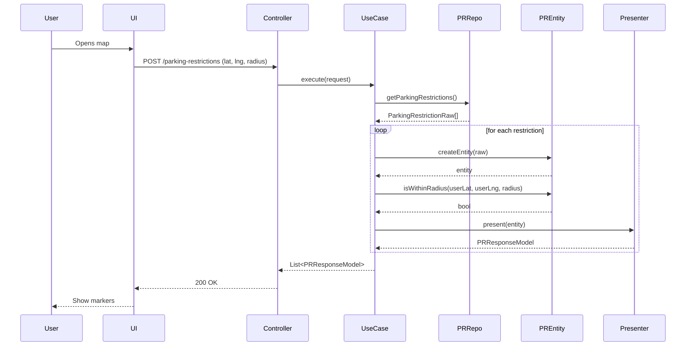
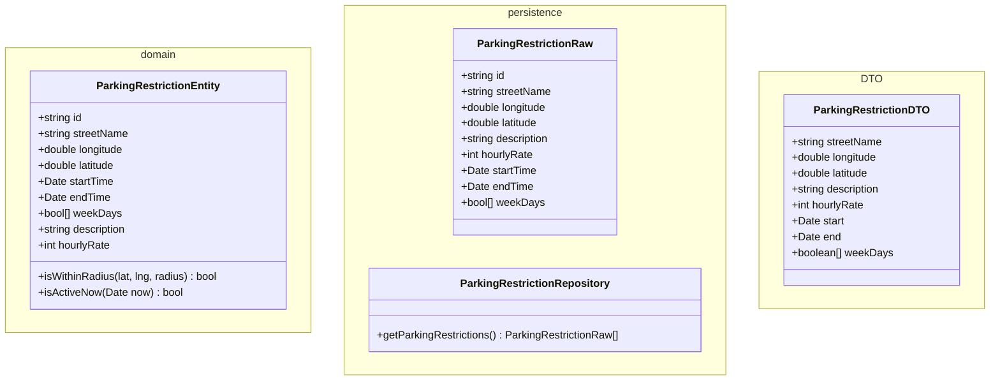

# App

### get maps

<!-- class PlacesPersistence {
      +string streetId
      +double longitude
      +double latitude
      +string nameStreet
      +int hourlyRate
    }

    class ReglementationPeriodsPersistence {
      +string code
      +number periodId
      +string description
    }

    class PeriodsPersistence {
      +int id
      +date startTime
      +date endTime
      +boolean monday
      +boolean tuesday
      +boolean wednesday
      +boolean saturday
      +boolean sunday
    }

    class EmplacementReglamentationsPersistence {
      +string emplacementId
      +string codeAutocollant
    } -->